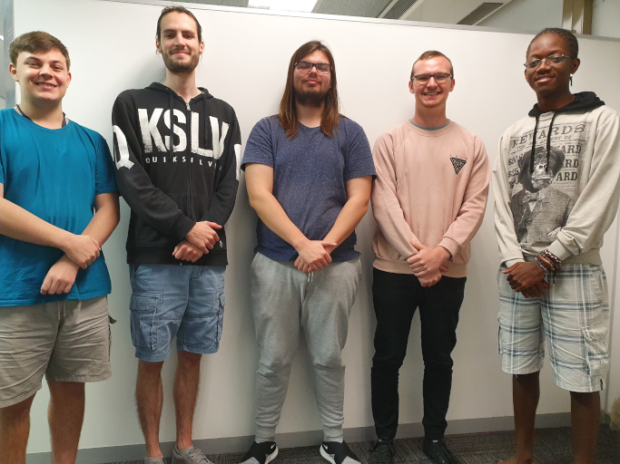

# Syntactic Sugar
## [Jargon](https://github.com/cos301-2019-se/Jargon/tree/master)

## Ethan Lindeman (Team Leader, Backend Services)
Bachelor of Information Technology (3rd year)
[GitHub](https://github.com/plethargy)

### Skills include:
C++ • JavaScript • Java • C#.NET • PHP • MEAN Stack • React framework

### Work Experience:
Teaching Assistant at the University of Pretoria, Second Semester of 2018 (Introduction toProgramming)
Teaching Assistant at the University of Pretoria, First Semester of 2019 (Data Structuresand Algorithms, Netcentric Computing Systems)

### About me:
At my core, I’m a problem solver. I love solving complex problems, and the more complex, the better. Technology and software development are what support thispassion of mine. I take pride in creating well-designed, easily understandable software that solves real world problemsefficiently. I could imagine no other career for myself other than one that is based in Software Development.

## Herbert Magaya
BSc Information Technology (3rd year)

### Skills include:
C/C++, Python, Java • MEAN stack • LAMP stack • BASH, Linux • Assembler • SAS, R

### Work Experience:
Short internship with EduOne, July of 2018

### About me:
I enjoy all things gaming, technology and multimedia related, basically I am obsessed with geek culture as a whole. I have been fascinated with computers from a very young age and am very passionate about computer programming. Since starting university I have also found myself interested in academia.

## Graeme Coetzee
Bachelor of Information Technology (3rd year)

### Skills include:
C++ • Java • JavaScript • LAMP Stack • MEAN Stack

### Work Experience:
Teaching Assistant at the University of Pretoria, First Semester of 2019 (Data Structures and Algorithms)

### About me:
I am a hard worker, and a problem solver. I am persistent in finding solutions to problems. I am a perfectionist, and I am very proud of my work. I have been passionate about computers and programming for as long as I can remember. I thoroughly enjoy taking on new challenges and furthering my knowledge. I envision myself in no other career other than in software development.

## Kevin Coetzee
Bachelor of Information Technology (3rd year)

### Skills include:
C++ • JavaScript • Java • LAMP stack • React framework • Node framework

### Work Experience:
Teaching Assistant at the University of Pretoria, Second Semester of 2018 (Introduction to Programming)
Teaching Assistant at the University of Pretoria, First Semester of 2019 (Imperative Programming)

### About me:
Coding and finding solutions to software problems is my way of creating something that matters. I enjoy building things that make peoples’ lives easier through the use of technology, and being able to learn in the process excites me.

## Christiaan Nel
BSc Computer Science (3rd year)

### Skills include:
C/C++ • Java • Assembler • Angular 7 • C#.NET

### Work Experience:
Full-time Junior Software Developer since November 2018. While working I increased my knowledge of Angular, started working with the .NET Core framework, and learned to coordinate with a small team on projects.
Teaching Assistant at the University of Pretoria, Second Semester of 2018 (Software Modelling)

### About me:
I am a tenacious Computer Science student that is eager to learn new concepts and I like to take on personal projects to increase my knowledge. I would like to see myself as a system programmer in the future. Technology and how they work on lower levels has always fascinated me, especially older hardware that can be emulated.

[Graeme Coetzee](https://github.com/GraemeCoetzee)| Fontend and UI Services
[Christiaan Nel](https://github.com/nelcht) | Frontend and UI, Machine Learning and AI Services
[Kevin Coetzee](https://github.com/KevinCoetzee10) | Backend and Third-party Interactive Services
[Herbert Magaya](https://github.com/sarrost) | DevOps, Machine Learning and AI Services
